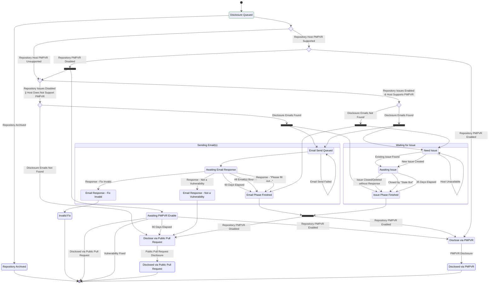

# Open Auto Vuln Disclose

```mermaid
stateDiagram-v2
    classDef StartState stroke:green
    classDef EndState stroke:blue
    [*] --> queued:::StartState
    state "Disclosure Queued" as queued
    state "Disclose via PMPVR" as disclose_PMPVR
    state "Disclosed via PMPVR" as disclosed_PMPVR
    state "Repository Archived" as repository_archived
    disclose_PMPVR --> disclosed_PMPVR:::EndState: PMPVR Disclosure
    state "Disclose via Public Pull Request" as disclose_PR
    state "Disclosed via Public Pull Request" as disclosed_PR
    disclose_PR --> disclosed_PR:::EndState: Public Pull Request Disclosure
    state "Awaiting PMPVR Enable" as awaiting_PMPVR
    state repository_host_PMPVR_if_state <<choice>>
    queued --> repository_host_PMPVR_if_state
    queued --> repository_archived:::EndState: Repository Archived
    repository_archived --> [*]
    state repository_PMPVR_if_state <<choice>>
    repository_host_PMPVR_if_state --> repository_PMPVR_if_state: Repository Host PMPVR Supported

    %% Disclosure Fork Conditional %%
    state repository_issues_enabled_and_PMPVR_supported_choice <<choice>>
    state email_choice_repository_issues_enabled_and_PMPVR_supported <<choice>>
    state email_choice_repository_issues_enabled_and_PMPVR_unsupported <<choice>>
    state fork_repository_issues_disable_or_PMPVR_unsupported_and_emails_found <<fork>>
    state fork_repository_issues_enabled_and_PMPVR_supported_and_emails_found <<fork>>
    state fork_repository_issues_enabled_and_PMPVR_supported_and_emails_not_found <<fork>>
    repository_issues_enabled_and_PMPVR_supported_choice --> email_choice_repository_issues_enabled_and_PMPVR_unsupported: Repository Issues Disabled || Host Does Not Support PMPVR
    repository_issues_enabled_and_PMPVR_supported_choice --> email_choice_repository_issues_enabled_and_PMPVR_supported: Repository Issues Enabled & Host Supports PMPVR
    email_choice_repository_issues_enabled_and_PMPVR_unsupported --> fork_repository_issues_disable_or_PMPVR_unsupported_and_emails_found: Disclosure Emails Found
    email_choice_repository_issues_enabled_and_PMPVR_unsupported --> disclose_PR: Disclosure Emails Not Found
    email_choice_repository_issues_enabled_and_PMPVR_supported --> fork_repository_issues_enabled_and_PMPVR_supported_and_emails_found: Disclosure Emails Found
    email_choice_repository_issues_enabled_and_PMPVR_supported --> fork_repository_issues_enabled_and_PMPVR_supported_and_emails_not_found: Disclosure Emails Not Found
    %% END Disclosure Fork Conditional %%

    fork_repository_issues_enabled_and_PMPVR_supported_and_emails_found --> need_issue
    fork_repository_issues_disable_or_PMPVR_unsupported_and_emails_found --> email_send_queued
    fork_repository_issues_enabled_and_PMPVR_supported_and_emails_found --> email_send_queued
    fork_repository_issues_disable_or_PMPVR_unsupported_and_emails_found --> issue_completed
    fork_repository_issues_enabled_and_PMPVR_supported_and_emails_not_found --> need_issue

    repository_host_PMPVR_if_state --> repository_issues_enabled_and_PMPVR_supported_choice: Repository Host PMPVR Unsupported

    state disclosure_fork_state <<fork>>
    disclosure_fork_state --> awaiting_PMPVR
    awaiting_PMPVR --> disclose_PMPVR : Repository PMPVR Enabled
    awaiting_PMPVR --> disclose_PR : 90 Days Elapsed
    state disclosure_join_state <<join>>
    repository_PMPVR_if_state --> disclosure_fork_state: Repository PMPVR Disabled
    disclosure_join_state --> disclose_PMPVR: Repository PMPVR Enabled
    repository_PMPVR_if_state --> disclose_PMPVR: Repository PMPVR Enabled
    disclosure_fork_state --> repository_issues_enabled_and_PMPVR_supported_choice

    %% Issue based PMPVR Request %%
    state "Waiting for Issue" as awaiting_issue {
        state "Need Issue" as need_issue
        need_issue --> need_issue: Host Unavailable
        state "Awaiting Issue" as awaiting_issue_response
        need_issue --> awaiting_issue_response : Existing Issue Found
        need_issue --> awaiting_issue_response : New Issue Created
        state "Issue Phase Finished" as issue_completed
        awaiting_issue_response --> issue_completed: Issue Closed/Deleted without Response
        awaiting_issue_response --> issue_completed: Closed by "Stale Bot"
        awaiting_issue_response --> issue_completed: 35 Days Elapsed
    }
    %% END Issue based PMPVR Request %%

    %% START Email Disclosure %%
    state "Sending Email(s)" as sending_emails {
        state "Email Send Queued" as email_send_queued
        email_send_queued --> email_send_queued: Email Send Failed
        state "Awaiting Email Response" as awaiting_email_response
        state "Email Phase Finished" as email_completed
        state "Email Response - Fix Invalid" as email_fix_invalid
        state "Email Response - Not a Vulnerability" as email_not_a_vulnerability
        email_send_queued --> awaiting_email_response
        awaiting_email_response --> email_fix_invalid: Response - Fix Invalid
        awaiting_email_response --> email_not_a_vulnerability: Response - Not a Vulnerability
    }
    sending_emails --> awaiting_email_response

    state "Invalid Fix" as fix_invalid
    email_fix_invalid --> fix_invalid:::EndState
    email_not_a_vulnerability --> disclose_PR
    awaiting_email_response --> email_completed: 90 Days Elapsed
    awaiting_email_response --> email_completed: All Email(s) Bounce
    awaiting_email_response --> email_completed: Response - "Please fill out..."
    email_completed --> disclosure_join_state
    fix_invalid --> [*]
    %% END Email Disclosure %%
    fork_repository_issues_enabled_and_PMPVR_supported_and_emails_not_found --> email_completed
    awaiting_PMPVR --> [*]: Disclosed via Public Pull Request
    awaiting_PMPVR --> [*]: Vulnerability Fixed
    issue_completed --> disclosure_join_state
    disclosure_join_state --> disclose_PR: Repository PMPVR Disabled
    disclosed_PR --> [*]
    disclosed_PMPVR --> [*]
```

